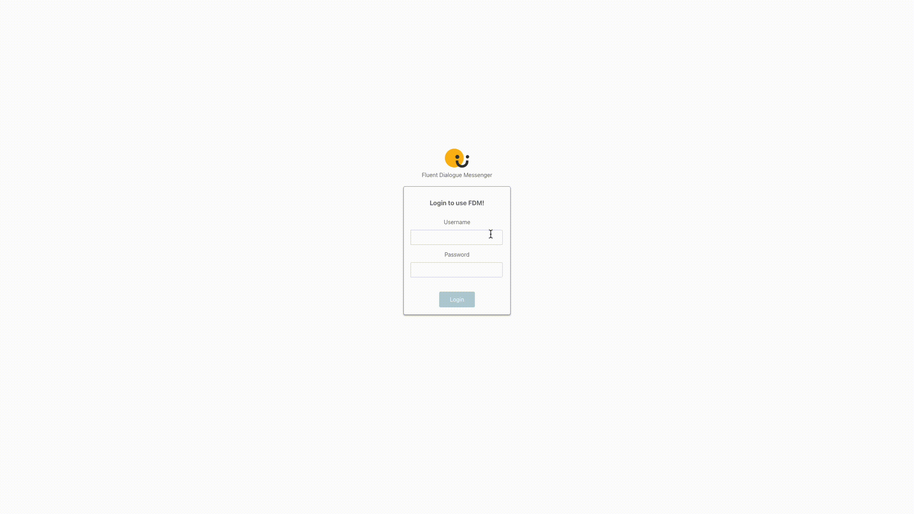
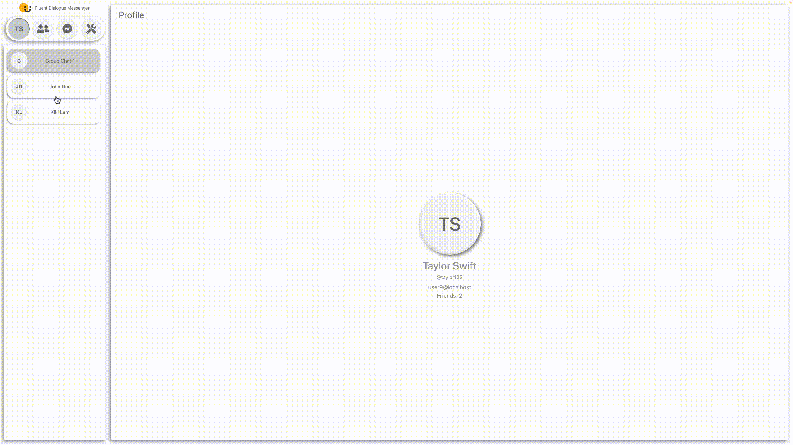
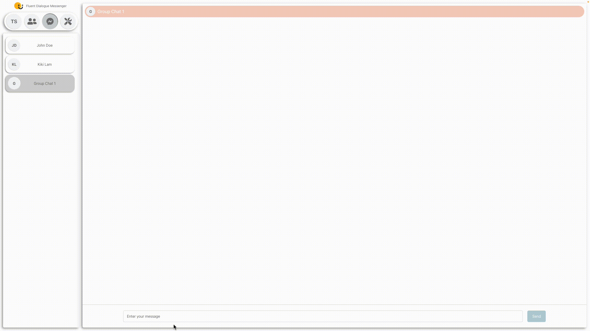
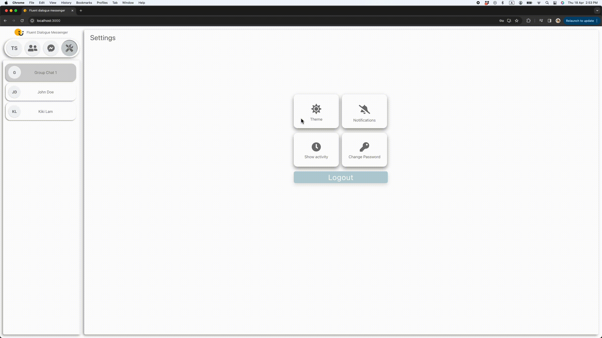
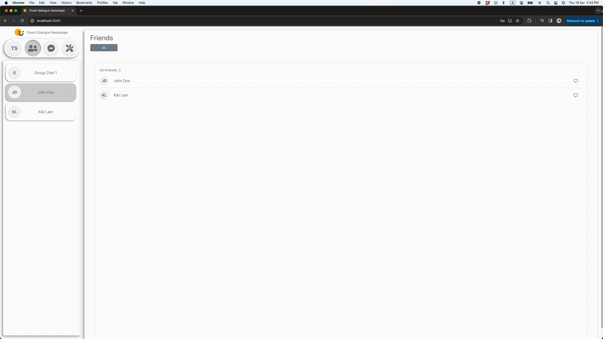

# Chat Web Application (Front-end)

This is a responsive and dynamic chat web application built with ReactJS, powered by an Express backend for real-time messaging using web sockets and a Scala backend for RESTful API integration. The application includes features such as private chat, group chat, notifications, and theme toggling, providing users with a seamless and interactive chat experience.


## Getting Started
Follow the steps below to set up and run the chat web application locally:

1. Clone the repository: 
    ``` git clone https://github.com/YilutMak/FDM-messenger.git ```
2. Install dependencies: ``` npm install ```
3. Ensure the Scala backend is running locally and Express backend is running on cloud.
4. Start the React development server: ``` npm start ```
5. Open the application in your browser: http://localhost:3000

## Demo
### Login


### Private Chat


### Group Chat


### Theme Toggling


### Friends Tab

